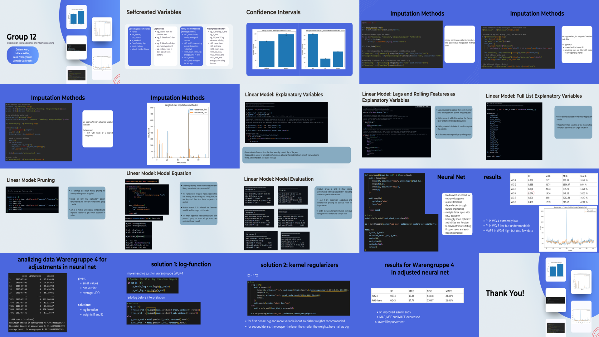

# [Your Project Title Here]

## Repository Link

[https://github.com/vikilouisa/Group-12-Data-Sc.-Machine-Learning]

## Description

[We received the sales data of two branches of a bakery in Kiel. The data was split into three parts: the training data, the validation data and the test data without the sales values. The goal was to predict the sales values of the test dataset. Therefore we learned how to perform linear regressions and use imputation methods for missing values and then train simple neural networks with Python and TensorFlow and use them for predictions. We worked in VSCode in the Python environment as well as in GitHub Repository as a team.]

### Task Type

[For the Baseline Model we used linear regression For the Neural Net we used the model of a feedforward neural net.]

### Results Summary

#### Best Model Performance
- **Best Model:** [Name and type of the best-performing model"]
- **Evaluation Metric:** [Primary metric used, e.g., Accuracy, F1-Score, MSE, MAE]
- **Final Performance:** [Best score achieved, e.g., 95% accuracy, F1-score of 0.87, MSE of 0.12]

#### Model Comparison
- **Baseline Performance:** [Baseline model performance for comparison]
- **Improvement Over Baseline:** [Quantitative improvement, e.g., "+12% accuracy", "25% reduction in MSE"]
- **Best Alternative Model:** [Second-best model and its performance]

#### Key Insights
- **Most Important Features:** [Top 3-5 features that drive model performance]
- **Model Strengths:** [What the model does well]
- **Model Limitations:** [Known limitations and failure cases]
- **Business Impact:** [Practical implications of the model performance]

## Documentation

1. **[Literature Review](0_LiteratureReview/README.md)**
2. **[Dataset Characteristics](1_DatasetCharacteristics/exploratory_data_analysis.ipynb)**
3. **[Baseline Model](2_BaselineModel/baseline_model.ipynb)**
4. **[Model Definition and Evaluation](3_Model/model_definition_evaluation)**
5. **[Presentation](4_Presentation/README.md)**

## Cover Image

