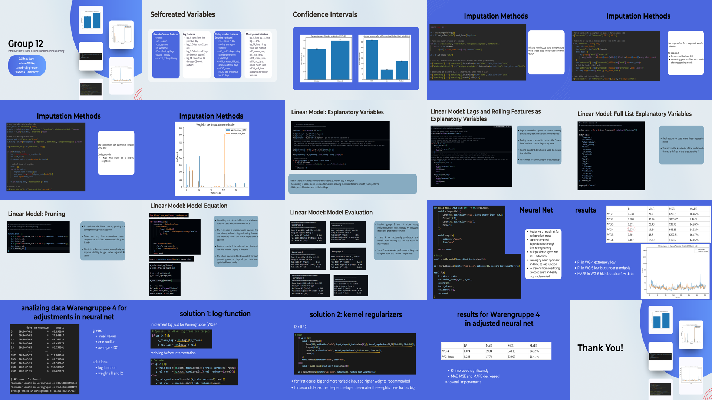

# Time-Series Sales Forecasting for a Bakery Using Linear Regression and Neural Networks

## Repository Link

https://github.com/vikilouisa/Group-12-Data-Sc.-Machine-Learning

## Description

This project aims to predict daily sales (Umsatz) of a bakery using machine learning methods. 
The dataset includes historical sales data across multiple product groups (Warengruppe), enriched with weather data and calendar-based features.

The prediction task is a supervised regression problem with a strict time-based train/validation/test split:

- Train: 01.07.2013 – 31.07.2017  
- Validation: 01.08.2017 – 31.07.2018  
- Test: 01.08.2018 – 31.07.2019  

The goal is to forecast sales values for the test period where the target variable is not provided.

Two modeling approaches were implemented:

1. Linear Regression (baseline model)
2. Feedforward Neural Networks (per product group)

Feature engineering plays a central role in the modeling process, including lag features, rolling statistics, seasonal transformations, and holiday indicators.

### Task Type

For the Baseline Model we used linear regression For the Neural Net we used the model of a feedforward neural net.

### Results Summary

#### Best Model Performance
- **Best Model:** Feedforward neural net
- **Evaluation Metric:** (weighted) R² for whole neural net and each product group seperately, MSE, MAE and MAPE for each product group
- **Final Performance:** Best score achieved: Weighted R² (val) = 0.551, Weighted MAPE (val) = 16.58%, and for each product group (on validation data):
    - Warengruppe 1 – Best score achieved: R² = 0.531, MSE = 840.78, MAE = 21.87, MAPE = 18.56%
    - Warengruppe 2 – Best score achieved: R² = 0.895, MSE = 1689.05, MAE = 31.02, MAPE = 8.83%
    - Warengruppe 3 – Best score achieved: R² = 0.869, MSE = 751.86, MAE = 20.35, MAPE = 14.08%
    - Warengruppe 4 – Best score achieved: R² = 0.245, MSE = 528.27, MAE = 17.80, MAPE = 21.26%
    - Warengruppe 5 – Best score achieved: R² = 0.223, MSE = 6028.07, MAE = 43.05, MAPE = 16.14%
    - Warengruppe 6 – Best score achieved: R² = 0.495, MSE = 492.20, MAE = 16.65, MAPE = 42.82%

#### Model Comparison
- **Baseline Performance:** R² per product group:
    - Warengruppe 1 – R² = 0.03
    - Warengruppe 2 – R² = 0.49
    - Warengruppe 3 – R² = 0.39
    - Warengruppe 4 – R² = -0.01
    - Warengruppe 5 – R² = 0.03
    - Warengruppe 6 – R² = 0.02
- **Improvement Over Baseline:** Difference in R² performance ranges from 0.17 (smallest, Warengruppe 4) to 0.51 (largest, Warengruppe 1)
- **Best Alternative Model:** As a second-best model, we consider our neural net prior to the late optimization for Warengruppe 4 (logarithmic transformation), which was introduced subsequently to improve performance.

#### Key Insights
- **Most Important Features:**
    - **lagged sales features** - historical sales are highly predictive of future sales
    - **rolling statistics** - moving averages capture trend and volatility
    - **calendar-based features** (weekday, public holiday, seasonal effects) - improve predictions, especially for volatile product groups
    - **logarithmic transormation** in Warengruppe 4 - demonstrates that certain product groups benefit from non-linear feature transformation
- **Model Strengths:** captures both short- and long-term patterns, improves performance over baseline, robust to seasonal fluctuations, and adapts to different product groups
- **Model Limitations:** still struggles with product groups with few data and highly volatile product groups (Warengruppe 4 and 6), but not as much as before in (linear) baseline model
- **Business Impact:** enables better production decisions, optimizes inventory to reduce overproduction or stockouts, and highlights challenging product groups for targeted improvements

## Documentation

1. **[Literature Review](0_LiteratureReview/README.md)**
2. **[Dataset Characteristics](1_DatasetCharacteristics/exploratory_data_analysis.ipynb)**
3. **[Baseline Model](2_BaselineModel/baseline_model.ipynb)**
4. **[Model Definition and Evaluation](3_Model/model_definition_evaluation.ipynb)**
5. **[Presentation](4_Presentation/README.md)**

## Cover Image

